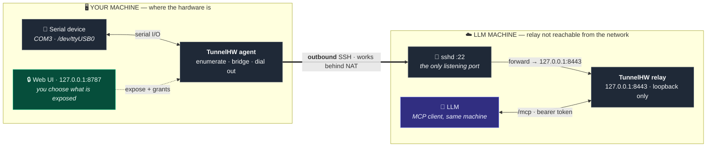
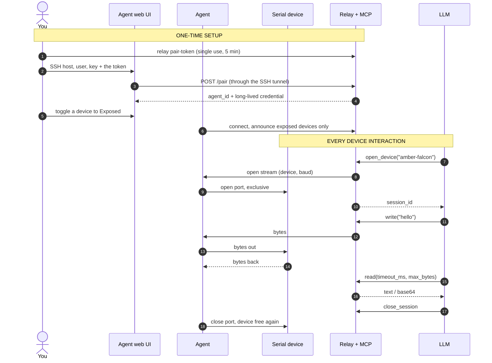

# TunnelHW

[](LICENSE)
[](https://github.com/chaugan/tunnelhw/releases)

**Plug a serial device into your machine and let an LLM on another machine use
it — as if it were plugged in there.**

You choose which devices are exposed, from a web UI on your own machine.
Nothing is exposed by default.

- **No public address needed.** If the LLM's machine runs `sshd`, the agent
  dials out over SSH and the relay listens on loopback only. No open ports, no
  certificates, works from behind NAT. (A direct TLS connection is also
  supported — see [Deployment topologies](#deployment-topologies).)
- **Every device gets a readable name** like `amber-falcon`, stable across
  replugs — that is the handle the LLM uses.
- **The LLM talks to it over MCP** (`list_devices`, `open_device`, `read`,
  `write`, `set_params`, `drain`, `close_session`), or a plain JSON API if it
  doesn't speak MCP.
- **Serial first:** USB adapters, native COM ports and UARTs, PCI serial
  cards, RS-232/485, Bluetooth SPP.
- **Foreground or background:** run either binary directly, or install it as a
  Windows service / systemd unit / launchd agent — see
  [Running as a service](#running-as-a-service).

Prebuilt binaries for Windows, Linux and macOS are on the
[releases page](https://github.com/chaugan/tunnelhw/releases). Design notes are
in [docs/ARCHITECTURE.md](docs/ARCHITECTURE.md); the security model is in
[SECURITY.md](SECURITY.md).

---

## Quickstart

Two binaries: the **agent** on the machine with the hardware, the **relay** on
the machine running the LLM. This walks the recommended SSH setup, which needs
no public address anywhere.

### 1. Relay — on the machine that runs the LLM

```bash
# Loopback only: not reachable from the network. SSH provides the encryption,
# so no TLS certificates are needed here.
./tunnelhw-relay-linux-amd64 serve --listen 127.0.0.1:8443 --insecure-dev

./tunnelhw-relay-linux-amd64 pair-token                  # single use, 5 min
./tunnelhw-relay-linux-amd64 api-token --name llm-host   # bearer token for the LLM
```

> **`--insecure-dev` turns TLS off.** That is correct *only* on loopback
> reached through SSH, as above. Never combine it with `--listen 0.0.0.0` or a
> public address — agent credentials and device traffic would cross the network
> in clear. For a directly reachable relay use `--tls-cert` and `--tls-key`
> instead. See [SECURITY.md](SECURITY.md).

### 2. Agent — on the machine with the hardware

```powershell
.\tunnelhw-agent-windows-amd64.exe      # or the linux/darwin binary
```

Open <http://127.0.0.1:8787> and:

1. Choose **Through SSH**, enter the LLM machine's SSH host and username, and a
   private key (prefer a key or `ssh-agent`; a password also works). Leave the
   relay URL blank — it defaults to the relay on the SSH host's loopback.
   `~/.ssh/config` is honoured, so a short alias resolves as it does in your
   terminal.
2. Paste the pairing token. Verify the SSH host-key fingerprint when prompted —
   it is recorded, and a *changed* key is refused from then on.
3. Toggle **Exposed** on the devices the LLM may use. Each gets its word ID.


Everything the LLM can reach is decided here: a device the LLM may use is one
you ticked. The activity log records every open, close and control-line change
— note that byte counts are logged, never payloads.

### 3. Connect the LLM

The MCP server is built into the relay — nothing extra to install. See
[Connecting the LLM](#connecting-the-llm).

---

## Connecting the LLM

### Register the MCP server

Point your MCP client at the relay's `/mcp` endpoint with the `api-token`
bearer. The relay runs on the LLM's own machine, so this is usually loopback.

Claude Code:

```bash
claude mcp add tunnelhw --transport http http://127.0.0.1:8443/mcp \
  --header "Authorization: Bearer <api token>"
```

Any client that takes a JSON config:

```json
{
  "mcpServers": {
    "tunnelhw": {
      "type": "http",
      "url": "http://127.0.0.1:8443/mcp",
      "headers": { "Authorization": "Bearer <api token>" }
    }
  }
}
```

**Restart the LLM session afterwards** — MCP servers load when a session
starts, so registering one mid-session does nothing.

### Verify it

Ask the LLM to list devices; it should name your exposed device. Independently
of the LLM:

```bash
curl -s -H "Authorization: Bearer <api token>" http://127.0.0.1:8443/api/v1/devices
```

An empty `{"devices":[]}` with the agent connected means nothing is toggled
**Exposed** yet — that is the usual cause.

### Rules worth knowing as the operator

The tool descriptions teach the model these; you need them to predict its
behaviour.

| Tool | Purpose |
|---|---|
| `list_devices` | word ID, transport, online/busy, fingerprint confidence |
| `open_device` | claim a device, returns a `session_id` |
| `read` | bounded read: `timeout_ms`, `max_bytes`, optional `delimiter` |
| `write` | send data, `utf8` or `base64` |
| `set_params` | change baud / toggle DTR / RTS mid-session |
| `drain` | wait for buffered output to reach the hardware |
| `close_session` | release the device |

- **Devices are exclusive.** One session at a time; a second `open_device`
  fails with a `busy` error naming the holder.
- **The port is only held during a session.** When no session is open the agent
  holds nothing, so your own terminal or IDE can use the device normally.
- **You can take a device back at any time.** **Release** in the web UI
  force-closes the session holding one device, leaving the tunnel and every
  other device untouched. Hiding a device also ends its session.
- **Reads never block indefinitely** and may return partial data.
- **Sessions do not survive a reconnect.** Session IDs become invalid and
  nothing is replayed; the model re-opens.
- **Control lines are a separate grant.** `set_params` is refused unless you
  enable **Control lines** for that device, because DTR/RTS can reset a board
  or drop it into its bootloader.
- **Read-only tokens** (`api-token --read-only`) allow only `list_devices` and
  `read`.

### Without MCP

Every capability is a plain JSON API under `/api/v1/` with the same token:

```bash
TOKEN=<api token>; B=http://127.0.0.1:8443/api/v1

curl -s -H "Authorization: Bearer $TOKEN" $B/devices

SID=$(curl -s -X POST -H "Authorization: Bearer $TOKEN" -H 'Content-Type: application/json' \
  -d '{"device_id":"amber-falcon","params":{"baud":115200}}' $B/sessions \
  | python3 -c 'import sys,json; print(json.load(sys.stdin)["session_id"])')

curl -s -X POST -H "Authorization: Bearer $TOKEN" -H 'Content-Type: application/json' \
  -d '{"data":"hello\r\n"}' $B/sessions/$SID/write
curl -s -X POST -H "Authorization: Bearer $TOKEN" -H 'Content-Type: application/json' \
  -d '{"timeout_ms":3000,"max_bytes":4096}' $B/sessions/$SID/read

curl -s -X DELETE -H "Authorization: Bearer $TOKEN" $B/sessions/$SID
```

---

## Running as a service

Both binaries run in the foreground by default — just launch them. Either can
instead be installed as a background service using the platform's own service
manager: **Windows services**, **systemd**, or **launchd**. Same subcommands
everywhere.

```bash
# The flags you give to "install" are recorded and replayed on every start.
tunnelhw-relay service install --listen 127.0.0.1:8443 --insecure-dev
tunnelhw-relay service start

tunnelhw-agent service install
tunnelhw-agent service start

# also: stop, restart, status, uninstall
tunnelhw-agent service status
```

Installed **for the current user** where the platform supports it (systemd
`--user`, launchd LaunchAgent); add `--system` for a system-wide service.

**Prefer a user service for the agent.** It resolves its config directory,
`~/.ssh/known_hosts`, `~/.ssh/config` and the ssh-agent from the user's
environment, so a service running as root or LocalSystem looks in a different
home directory and fails to authenticate in ways that are hard to diagnose.
The same applies to the relay's `--state-dir`: a system service will not see
credentials you minted under your own account, so pass `--state-dir`
explicitly to both the service and the `pair-token` / `api-token` commands.

Platform notes, which `service install` also prints:

| Platform | Notes |
|---|---|
| **Linux** | A `--user` service stops at logout unless you enable lingering: `sudo loginctl enable-linger $USER`. Serial ports usually need `sudo usermod -aG dialout $USER`. Installing over plain SSH may fail with no user D-Bus instance — the error explains the options. |
| **macOS** | Installs a LaunchAgent for your user; `--system` writes a LaunchDaemon. |
| **Windows** | Has no per-user services, so this always runs as **LocalSystem**, whose home directory is not yours. For the agent that means your `~/.ssh` keys and ssh-agent are unavailable — either pass explicit paths (`--config-dir`, an absolute key path in the web UI) or run the agent in the foreground. |

The service records the binary's current path, so reinstall if you move it.

## How it fits together

The recommended setup (**topology A**), where the agent dials out over SSH and
the relay is reachable only on the LLM machine's loopback:



The one-time setup, then what happens on every device call:



## Deployment topologies

The relay only needs to be reachable **by the agent**. It does not need a
public IP.

| | Setup | When |
|---|---|---|
| **A. SSH carrier** *(recommended)* | Relay on the LLM machine, bound to loopback; agent dials out over SSH. No certificates, nothing listening but `sshd`. | The LLM machine runs `sshd`. |
| **B. Direct** | Relay reachable at `wss://host:8443` with `--tls-cert`/`--tls-key`; agent uses **Direct to relay**. | Same LAN/VPN, or the relay legitimately has a public address. |
| **C. Overlay network** | Both machines on Tailscale/WireGuard; relay on the LLM machine, agent uses its mesh address. | Neither machine is reachable and you would rather not use SSH. |

The agent has an SSH client built in for topology A — there is no `ssh -L` to
run or keep alive.

## Security

Full detail in [SECURITY.md](SECURITY.md), including how to report a
vulnerability. The essentials:

- **The relay is trusted and self-hosted.** A compromised relay can operate
  every *currently exposed* device. It must see device bytes in clear because
  it serves them to the LLM.
- **Hidden devices are never disclosed to the relay.** Exposure is opt-in per
  device and revocable, and hiding a device ends its session immediately.
- **The API token is a credential for physical access.** Don't commit it; use
  `--read-only` where that suffices; revoke and re-mint if it leaks.
- **Control-line access is granted per device**, because it can reset hardware.
- Serial payloads are never logged; logs carry metadata only.

## Compared to the alternatives

TunnelHW is not a general-purpose tunnel. It is a device control plane for LLMs.

| | What it gives you | What it doesn't |
|---|---|---|
| `ser2net` / RFC2217 | Serial over TCP | No NAT traversal, no selection UI, no LLM interface, no naming |
| `ssh -R` / `frp` / ngrok | Generic port forwarding | A port, not a device: no enumeration, no per-device consent, no session model |
| USB/IP | Full USB passthrough | Kernel drivers, privileged, fragile across platforms; overkill for serial |
| **TunnelHW** | Enumeration, human-readable stable IDs, per-device consent + grants, exclusive sessions, LLM-safe bounded I/O, MCP and JSON APIs | Not multi-tenant, not a hosted service, serial only for now |

## Notes from real use

- **A silent device is normal.** Plenty of firmware prints nothing until
  prompted or reset. With control lines granted, a DTR/RTS pulse produces a
  boot log — on an ESP32 the reset reason (`rst:0x15 USB_UART_CHIP_RESET`)
  confirms the control line reached the chip.
- **Weak fingerprints move.** A board reporting no USB serial number is
  identified by VID:PID plus port path, so replugging it elsewhere can produce
  a new word ID. The UI flags this as weak confidence.
- **Host key "changed"** on first connect usually means your `known_hosts` has
  a different algorithm's key for that host; TunnelHW retries pinned to the
  recorded algorithms before reporting a change.
- **Minting a token needs no relay restart**, but registering an MCP server
  does need an LLM session restart.
- **macOS cross-compiles** enumerate with degraded metadata (no USB serial
  numbers — macOS needs cgo/IOKit). Build natively with `CGO_ENABLED=1` for
  full fingerprinting.

## Development

```bash
go test -race ./...        # no hardware required
go vet ./...
scripts/build.sh <version> # cross-compile everything into dist/
```

The end-to-end tests wire the real agent to the real relay over a live
WebSocket with an in-memory serial device, and a second suite runs the same
path through an in-process SSH server.

```
cmd/agent/          # local agent binary + tunnel lifecycle
cmd/relay/          # relay binary: serve + pair-token/api-token/agents/revoke
internal/agent/     # device registry, exclusive sessions, tunnel client
internal/auth/      # pairing tokens, agent credentials, API tokens (hashed)
internal/config/    # agent config persistence (atomic, 0600)
internal/mcp/       # MCP adapter over the relay API
internal/mux/       # pinned yamux configuration
internal/names/     # curated wordlists + stable word-pair IDs
internal/proto/     # control protocol: framing, versioning, correlation IDs
internal/relay/     # hub: agent tunnels, device announces, stream brokerage
internal/relayapi/  # the core API + its HTTP surface (MCP maps onto this)
internal/serialdev/ # enumeration, tiered fingerprinting, port I/O
internal/sshtun/    # SSH carrier: known_hosts policy, ssh-agent, ssh_config
internal/webui/     # localhost web UI handlers + hardening
internal/e2e/       # end-to-end tests, incl. an in-process sshd
web/                # zero-build UI assets (go:embed)
docs/               # architecture & design review
```

See [CONTRIBUTING.md](CONTRIBUTING.md). Security issues: [SECURITY.md](SECURITY.md).

## License

MIT — see [LICENSE](LICENSE).
